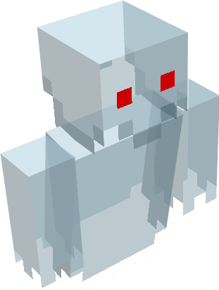

# Boohoo!
 
 

This mod was made for [SpookyJam 2021](https://www.curseforge.com/minecraft/modpacks/spookyjam-2021-forge-edition). 
It contains a ghost which could spawn at night.
The chance for being summoned is configurable. 
This was my first mod which added a custom living entity.

Default chance is **0.1%** each tick that a ghost spawns next to you. 

The health increases by attacking other players and entities. It decreases when you get damage. 
The health can also be configured by a multiplier in the config.

Each player can only have one ghost each night. 

If the ghost kills you, it will stay in the world and fly around a bit, without targeting other players. 
The ghost disappears after (default) 60 seconds. 

It will steal you a random item when it kills you (configurable). This item will be dropped when the ghost disappears
or dies. 

The ghost drops 1 to 2 enchanted books with a random enchantment. For each book, there is a 5% chance that the 
enchantment level is the highest possible level for this enchantment. If you'd get this book, you also have a 50% chance
that the level is max level + 1.

The ghost disappears at day (configurable). 

If you want to disable the ghost in any dimension, there's a list in the config for that.

