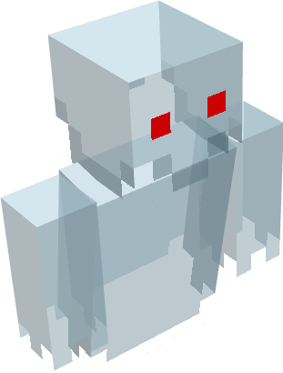

# Boohoo!
 [![](https://img.shields.io/badge/dynamic/json?color=5da545&label=&labelColor=383838&prefix=%20&query=downloads&url=https://api.modrinth.com/api/v1/mod/RYjHe0FQ&style=flat-square&logo=data:image/svg+xml;base64,PHN2ZyB4bWxucz0iaHR0cDovL3d3dy53My5vcmcvMjAwMC9zdmciIHZpZXdCb3g9IjAgMCAxMSAxMSIgd2lkdGg9IjE0LjY2NyIgaGVpZ2h0PSIxNC42NjciICB4bWxuczp2PSJodHRwczovL3ZlY3RhLmlvL25hbm8iPjxkZWZzPjxjbGlwUGF0aCBpZD0iQSI+PHBhdGggZD0iTTAgMGgxMXYxMUgweiIvPjwvY2xpcFBhdGg+PC9kZWZzPjxnIGNsaXAtcGF0aD0idXJsKCNBKSI+PHBhdGggZD0iTTEuMzA5IDcuODU3YTQuNjQgNC42NCAwIDAgMS0uNDYxLTEuMDYzSDBDLjU5MSA5LjIwNiAyLjc5NiAxMSA1LjQyMiAxMWMxLjk4MSAwIDMuNzIyLTEuMDIgNC43MTEtMi41NTZoMGwtLjc1LS4zNDVjLS44NTQgMS4yNjEtMi4zMSAyLjA5Mi0zLjk2MSAyLjA5MmE0Ljc4IDQuNzggMCAwIDEtMy4wMDUtMS4wNTVsMS44MDktMS40NzQuOTg0Ljg0NyAxLjkwNS0xLjAwM0w4LjE3NCA1LjgybC0uMzg0LS43ODYtMS4xMTYuNjM1LS41MTYuNjk0LS42MjYuMjM2LS44NzMtLjM4N2gwbC0uMjEzLS45MS4zNTUtLjU2Ljc4Ny0uMzcuODQ1LS45NTktLjcwMi0uNTEtMS44NzQuNzEzLTEuMzYyIDEuNjUxLjY0NSAxLjA5OC0xLjgzMSAxLjQ5MnptOS42MTQtMS40NEE1LjQ0IDUuNDQgMCAwIDAgMTEgNS41QzExIDIuNDY0IDguNTAxIDAgNS40MjIgMCAyLjc5NiAwIC41OTEgMS43OTQgMCA0LjIwNmguODQ4QzEuNDE5IDIuMjQ1IDMuMjUyLjgwOSA1LjQyMi44MDljMi42MjYgMCA0Ljc1OCAyLjEwMiA0Ljc1OCA0LjY5MSAwIC4xOS0uMDEyLjM3Ni0uMDM0LjU2bC43NzcuMzU3aDB6IiBmaWxsLXJ1bGU9ImV2ZW5vZGQiIGZpbGw9IiM1ZGE0MjYiLz48L2c+PC9zdmc+)](https://modrinth.com/mod/boohoo) 

This mod was made for [SpookyJam 2021](https://www.curseforge.com/minecraft/modpacks/spookyjam-2021-forge-edition). 
It contains a ghost which could spawn at night.
The chance for being summoned is configurable. 
This was my first mod which added a custom living entity.

Default chance is **0.1%** each tick that a ghost spawns next to you. 

The health increases by attacking other players and entities. It decreases when you get damage. 
The health can also be configured by a multiplier in the config.

Each player can only have one ghost each night. 

If the ghost kills you, it will stay in the world and fly around a bit, without targeting other players. 
The ghost disappears after (default) 60 seconds. 

It will steal you a random item when it kills you (configurable). This item will be dropped when the ghost disappears
or dies. 

The ghost drops 1 to 2 enchanted books with a random enchantment. For each book, there is a 5% chance that the 
enchantment level is the highest possible level for this enchantment. If you'd get this book, you also have a 50% chance
that the level is max level + 1.

The ghost disappears at day (configurable). 

If you want to disable the ghost in any dimension, there's a list in the config for that.

