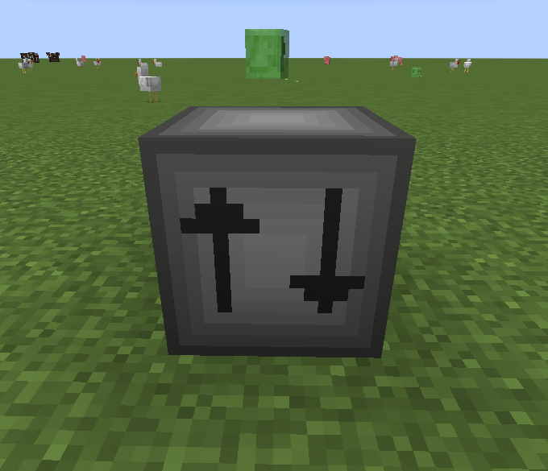

# NBT Remover

This mod was mainly created to fix the problem with recipes where the ingredients should not have any nbt data. This block
simply removes the nbt from the items.

The mod was the first of my mods which included a real tile entity. (Except [Present Stand](../present-stand/index.md) 
but that's another story)

It's not recommended to use this mod as it's deleting items sometimes. Could be very... annoying. Seriously, don't use it.
