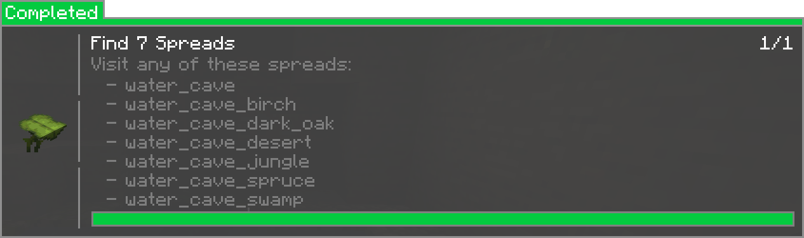

# Compatability with other mods
## Cadmus
This mod is compatible with [Cadmus 🔗](https://modrinth.com/mod/cadmus). If Cadmus is installed, a new 
[config](config/compat/cadmus.md) will be registered. This includes mainly protecting spawn chunks by the mod itself.
There's also the command `/cadmus skyblockbuilder protectSpawn` for claiming the spawn chunks after a world was created.
This is helpful in packs where the setting is disabled by default but the server owner wants to claim them.

## Curios
This mod is compatible with [Curios 🔗](https://modrinth.com/mod/curios). This only means that
items will be dropped from the Curios inventory when leaving a team and
[the config](config/inventory.md#dropping-inventory) is enabled, too.

## Heracles
This mod is compatible with [Heracles 🔗](https://modrinth.com/mod/heracles). It adds a new task type for
[spreads](packdev/packdev.md#configuring-templates). If Heracles is installed, a new [config](config/compat/heracles.md)
will be registered. You can combine multiple spreads in the GUI by using `|` as separator. This would be the input for 
the example below: 
`water_cave|water_cave_birch|water_cave_dark_oak|water_cave_desert|water_cave_jungle|water_cave_spruce|water_cave_swamp`


## MineMention
This mod is compatible with [MineMention 🔗](https://modrinth.com/mod/minemention). To write in the 
teams chat, you can use `skyblockbuilder:sky_team` in MineMention config file. This would look like this:
```json
{
  "mentions": {
    "everyone": "minemention:everyone",
    "here": "minemention:here",
    "team": "skyblockbuilder:sky_team"
  }
}
```