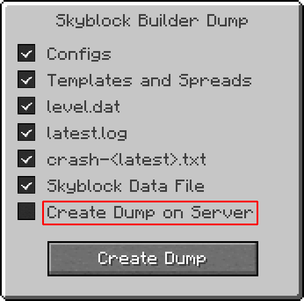

# Creating Issues

Here's the GitHub link to report issues for Skyblock Builder: https://github.com/ChaoticTrials/SkyblockBuilder/issues/new/choose

## Report bugs
### Normal Report

The normal way would be to use the `Bug Report (Manual Mode)` template when clicking the link above. In that case, you
need to put in a title, select a **Minecraft version** the bugs occurs, the used **LibX**, **Skyblock Builder**, and 
**Forge** version, the [`latest.log`](https://git.io/mclogs), a **detailed description** of the issue, and a few steps 
**how to reproduce** the bug. If the problem only happens in a pack, please include a link to the pack, and the exact 
version you're using. If the pack is still unreleased, provide an exported version of the pack with the most important 
configs.
If you don't want to share it public, feel free to visit my [Discord server 🔗](https://discord.chaotictrials.de) and
send a DM to the user `@MelanX`.

### Dump Report

With 1.20.1, a new command was introduced, called `/skyblock dump`. That opens a screen which you can see below:

*The red outlined option only shows for op players*

There you can configure what your dump report should include. It is recommended to include all the data. However, you're
free to de-select some values for whatever reason. Explanation for each option:

- `Configs` -> Dump file includes all config files of Skyblock Builder
- `Templates and Spreads` -> Dump file includes all **files** in the `config/skyblockbuilder/templates` directory
- `level.dat` -> Dump file includes the `level.dat` of the world you're in
- `latest.log` -> Dump file includes the `latest.log` file, this also includes all chat messages of this run and may include ip addresses
- `crash-<latest>.txt` -> Dump file includes the latest crash report if present. If you didn't encounter a crash for this issue, de-select it as it would include a maybe non-related crash report
- `Skyblock Data File` -> Dump file includes the files `world/data/skyblock_builder.dat` and `world/data/template.dat`, which contains all the metadata of all teams, such as member ids, island position, team name and some more
- `Create Dump on Server` -> Dump file will be generated on the server side, useful as admin when the crash is server side

The `Create Dump` button will create a zip file, located in `<instance>/skyblockbuilder/dumps`. The exact name can be
viewed in chat. When clicking the message, the folder will be opened. Use the template `Bug Report (Dump Mode)` on
GitHub. That way, you only need to provide the **Minecraft version**, the **dump file**, a **detailed description**,
and a few steps **how to reproduce** the bug. If the problem only happens in a pack, please include a link to the pack, 
and the exact version you're using. If the pack is still unreleased, provide an exported version of the pack with the 
most important configs.
If you don't want to share it public, feel free to visit my [Discord server 🔗](https://discord.chaotictrials.de) and
send a DM to the user `@MelanX`.

### Feature requests

Use the `Feature request` template to suggest any new feature. New features will most likely only be implemented in the
latest version of the mod. Sometimes, new features need to change the code too much, so that it will be added in the
next major Minecraft version.
